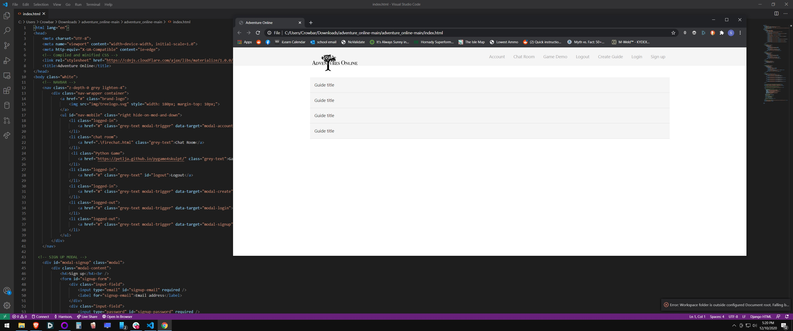
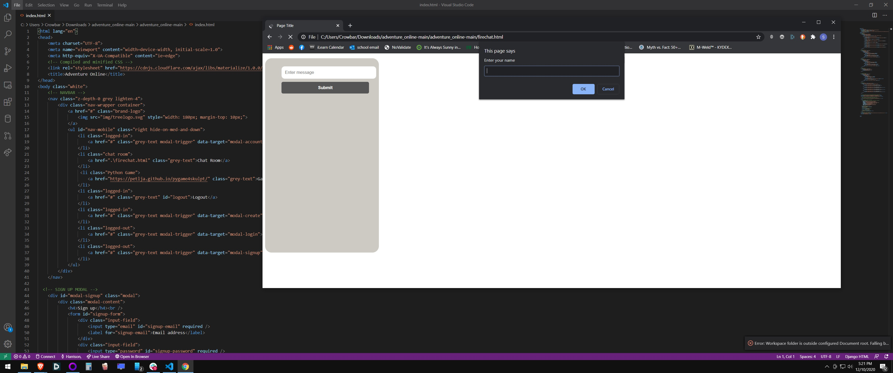
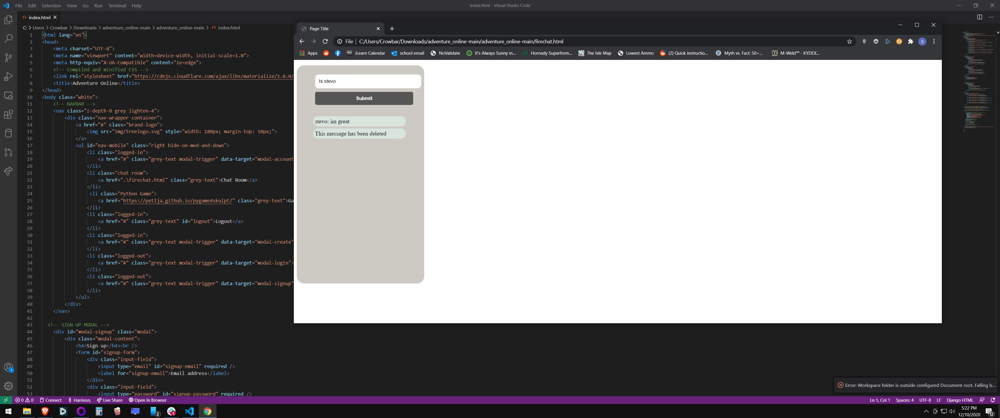
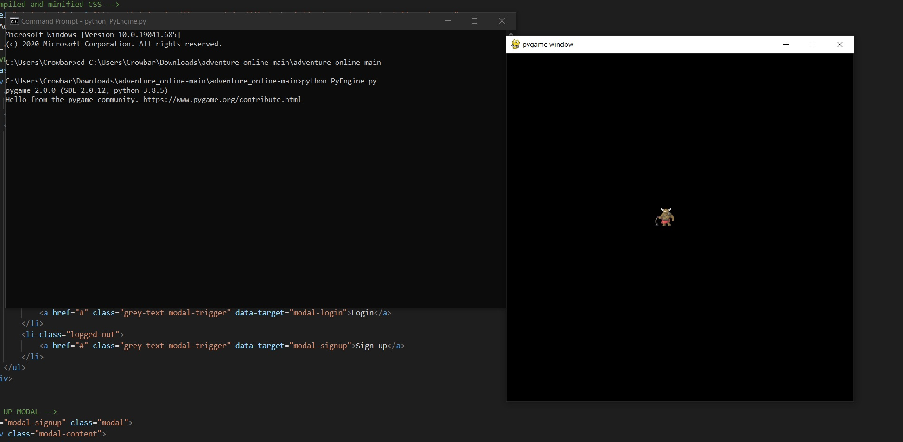

# Overview

This program is the beginnings of a full stack for a MMO (Massive Multiplayer Online).  The goal was to connect together a log in and signup page, a chatroom, and a game.  The database for log in, and the chat functionality is handled using firebase.  The website is a single webpage design.  

# Development Environment
* Javascript
* Html
* Firebase

# Execution
To use this program download the .html and .js files, then run the program.  The .py and .PNG files can be ran seperately to generate the game.  Below are images of the functioning game.

# Useful Websites
* https://firebase.google.com/docs/web/setup?authuser=0

